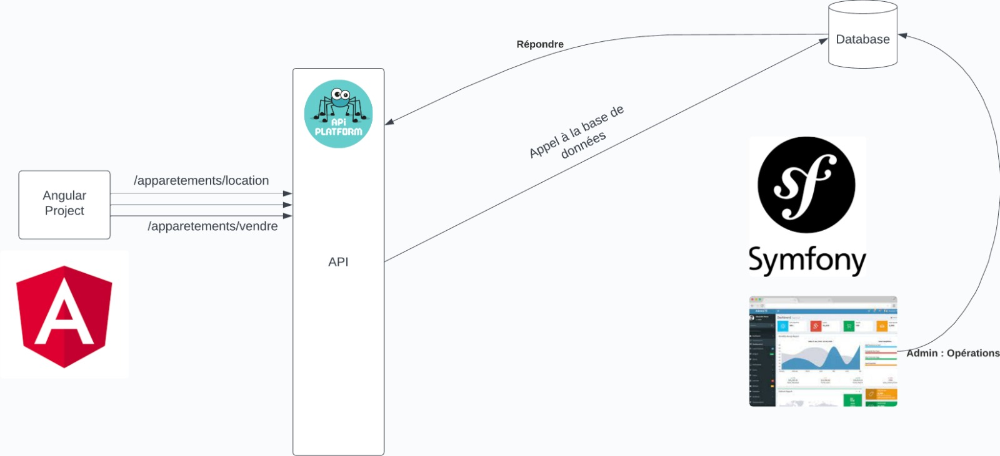

# Projet fin d'année: Immobliliers


## De quoi il s'agit?  

L'objectif principal du projet est de créer une plateforme où l'utilisateur final peut consulter différents lieux d'hébergement pour la location/l'achat.

## Réalisé par:  
  
[HAMOUICH Walid][walid-github-profile]  
[BENALI Mohamed-Amine][medamine-github-profile]  
[EL-MOUSSAOUI Chakir][chakir-github-profile]  
[BENMASSAOUD ilyas][ilyas-github-profile]  
[BELMADANI Mohamed][belmadani-github-profile]  
  
## Encadré par:  

[Issam Khadiri][issam-github-profile]  
  
## L'architecture principale à suivre:



## La modélisation:

[Diagrammes.pdf](./Modelisation/Diagrammes.pdf)

## Pour les collaborateurs:  

### Comment commencer?  
  
Installer d'abord [git][git-download-link], puis passez la commande suivante dans le cmd de Windows ou le terminal de Linux:  
```
git clone https://github.com/PFA-Immobilier/App-Immobilier
```

Puis installer [nodejs][nodejs-download-link], et aprés éxecuter les commandes suivantes dans le cmd de Windows ou le terminal de Linux:

```
cd ./Apps/frontend
```
```
npm install
```

Si vous voulez, vous pouvez télecharger [Make](https://gnuwin32.sourceforge.net/packages/make.htm) pour simplifier la vie.

#### Pour éxecuter toutes les services disponibles:
Executer les commandes suivantes:
```
cd ./Apps/
```
```
docker compose up
```
cette commande va construire l'image si elle n'est pas déjà construite, alors il éxecutera le conteneur.  

#### Pré-requis pour que les serviecs fonctionnent correctement: 

le service backoffice:
```
cd ./Apps
docker compose exec backoffice bash
composer install
```

Pour le service api:
```
cd ./Apps
docker compose exec api bash
composer install
```

### En utilisant Make:
Pour démarrer les conteneurs:
```bash
make docker-start
```

Et pour les arrêter:

```bash
make docker-stop
```

### Activation du husky:

```bash
make prepare-husky
```

### Trello

Clicker [ici](https://trello.com/invite/b/lJoQ7Z3P/ATTI96a26f64df183f4838adfe0ff530eddaED251CC1/pfa-2024) pour nous rejoindre !

### Régles à respecter pour contribuer:

 - Premièrement la language doit être unifé, et pour ce projet nous allons travailler avec l'anglais (Exception: les modèles de conception doivent être en français car c'est le MAROC, et l'école est une école francophone).
    - Donc le nom des variables doit être en anglais et bien sûre significatif  
 - Les message de commits aussi dans git doivent être significatif

[git-download-link]: https://git-scm.com/downloads
[nodejs-download-link]: https://nodejs.org/en
[our-repo]: https://github.com/PFA-Immobilier/App-Immobilier
[chakir-github-profile]: https://github.com/Chakirmousse
[walid-github-profile]: https://github.com/OBAM4
[medamine-github-profile]: https://github.com/medamine980
[ilyas-github-profile]: https://github.com/ilyasbenmassaoud
[belmadani-github-profile]: https://github.com/mohamedbelmadani
[issam-github-profile]: https://github.com/issamkhadiri1989